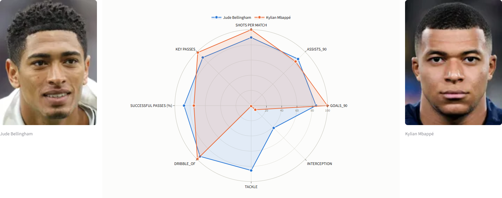

# TFM — Scouting y valoración de futbolistas

Sistema de análisis de jugadores de fútbol que combina depuración de datos, *feature engineering*, similitud de perfiles y modelos de aprendizaje automático para apoyar tareas de scouting.

El proyecto estudia 2.028 jugadores de campo de siete ligas europeas durante la temporada 2025-2026. La interfaz permite buscar perfiles similares, candidatos de mejora, posibles jugadores infra/sobrevalorados y comparativas mediante radar.



## Ejecutar en Windows sin instalar Python

El ejecutable se distribuye como un ZIP desde la sección [Releases](https://github.com/alejandro-mrtnz/tfm-scouting-futbol/releases). No se incluye directamente en el repositorio porque `TFM_Scouting.exe` ocupa aproximadamente 235 MiB.

1. Descarga `TFM_Scouting-Windows-v1.0.0.zip` desde la versión más reciente.
2. Descomprime el ZIP completo en una carpeta local.
3. No separes `TFM_Scouting.exe` de la carpeta `artifacts`.
4. Haz doble clic en `TFM_Scouting.exe`.
5. Espera unos segundos: la aplicación abrirá automáticamente una pestaña del navegador y funcionará en el equipo local.

Windows puede mostrar una advertencia de SmartScreen porque el ejecutable no está firmado digitalmente. Solo debe ejecutarse si se ha descargado desde la Release oficial de este repositorio.

Consulta [EJECUTAR_APLICACION.md](EJECUTAR_APLICACION.md) para ver las instrucciones completas y la resolución de problemas.

## Funcionalidades

- Recomendación de jugadores con un perfil estadístico similar.
- Búsqueda de mejoras sujetas a presupuesto, edad y situación contractual.
- Estimación del valor de mercado a partir del rendimiento.
- Detección exploratoria de posibles infra y sobrevaloraciones.
- Análisis de plantilla, ficha individual y gráficos radar interactivos.
- Pipeline reproducible desde el Excel depurado hasta los artefactos de la aplicación.

## Resultados del modelado

Los resultados documentados se obtuvieron mediante validación cruzada de 5 particiones y predicciones *out-of-fold*:

| Modelo | R² | MAE (millones de euros) |
| --- | ---: | ---: |
| Random Forest | 0,7118 | 6,588 |
| Gradient Boosting | 0,7323 | 6,114 |
| XGBoost | 0,7417 | 6,039 |
| XGBoost con máximo histórico¹ | 0,9220 | 2,975 |

¹ El modelo con máximo histórico se usa únicamente como estimación contextual en la ficha. No alimenta la detección de oportunidades, porque introducir esa variable diluiría la señal de rendimiento.

## Puesta en marcha

Requisitos: Python 3.11 o posterior.

```powershell
py -3.13 -m venv .venv
.venv\Scripts\Activate.ps1
python -m pip install --upgrade pip
python -m pip install -r requirements.txt
```

Coloca `Estadisticas Jugadores 2025-2026.xlsx` en la raíz del proyecto. El fichero no se distribuye en el repositorio; consulta [DATA.md](DATA.md) para conocer su procedencia y el flujo completo.

Genera los artefactos del modelo:

```powershell
python app\train.py
```

Inicia la interfaz:

```powershell
python -m streamlit run app\app.py
```

La primera ejecución de entrenamiento puede tardar varios minutos, ya que evalúa tres modelos con validación cruzada.

## Reproducción del análisis

1. `DEPURADOR.ipynb` carga y unifica los datos originales de Transfermarkt y WhoScored.
2. El resultado depurado se guarda como `Estadisticas Jugadores 2025-2026.xlsx`.
3. `MODELIZACION.ipynb` documenta la exploración, las transformaciones y la comparación de modelos.
4. `app/train.py` contiene el pipeline productivo y genera `artifacts/`.
5. `app/app.py` consume esos artefactos y sirve la aplicación Streamlit.

Para trabajar con los notebooks o reconstruir el ejecutable, instala además:

```powershell
python -m pip install -r requirements-dev.txt
```

El ejecutable de Windows se puede reconstruir desde la carpeta `app`:

```powershell
Set-Location app
pyinstaller --clean TFM_Scouting.spec
```

El binario resultante no se versiona dentro del repositorio. Se publica como archivo adjunto de una Release junto con los artefactos que necesita para arrancar.

## Estructura

```text
.
├── app/                         # Aplicación, pipeline y modelos
├── artifacts/                   # Salidas locales generadas por train.py
├── figuras/                     # Gráficos y capturas de resultados
├── DEPURADOR.ipynb              # Limpieza y unión de fuentes
├── MODELIZACION.ipynb           # Análisis y modelado experimental
├── EJECUTAR_APLICACION.md        # Uso de la versión para Windows
├── DATA.md                      # Procedencia y política de datos
└── requirements*.txt            # Dependencias de ejecución y desarrollo
```

## Limitaciones

- Los resultados describen una temporada y una selección concreta de ligas; no deben extrapolarse sin reentrenar y validar.
- El valor de mercado es una estimación y no equivale necesariamente a un precio de traspaso.
- Los porteros se excluyen porque requieren variables y criterios de comparación diferentes.
- Los datos y fotografías de terceros están sujetos a las condiciones de sus fuentes. Este repositorio no redistribuye los datasets originales ni las imágenes.

## Licencia y reutilización

No se incluye una licencia de redistribución para los datasets ni para los recursos obtenidos de terceros. En ausencia de un fichero `LICENSE`, el código y la documentación permanecen bajo los derechos de su autor.
